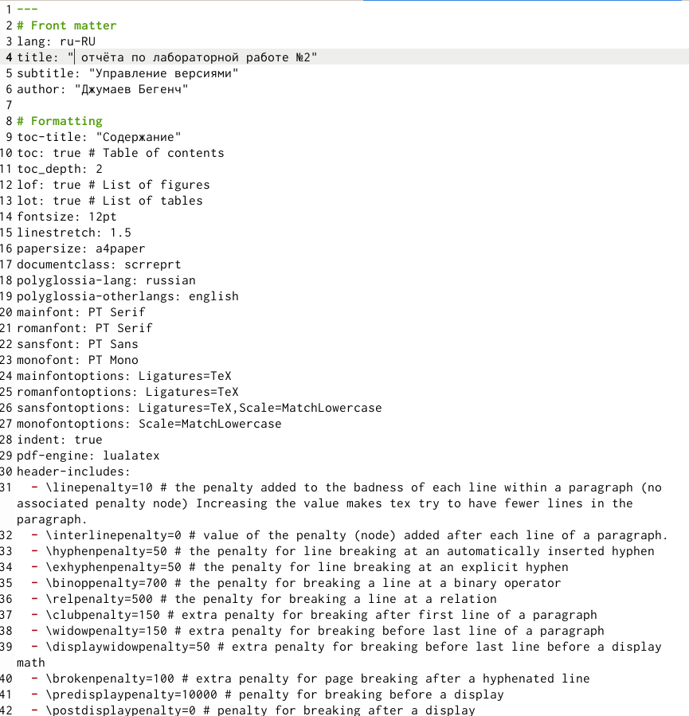
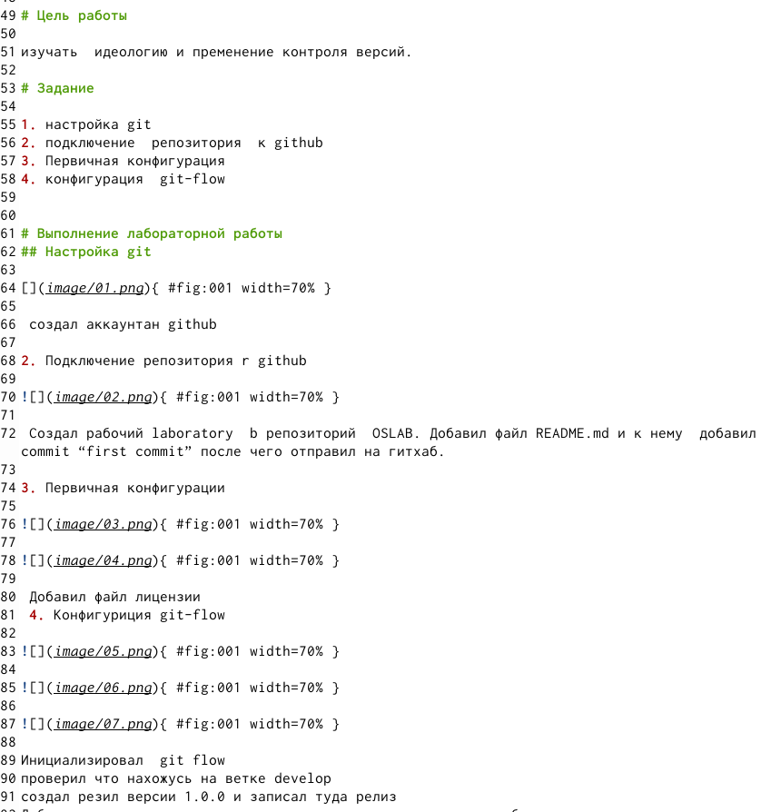
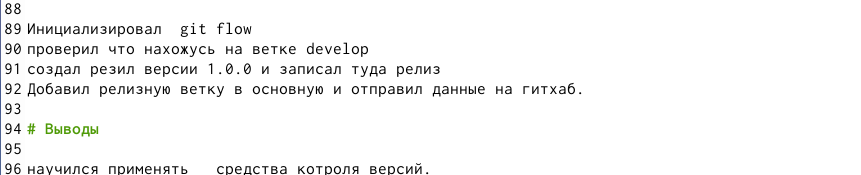
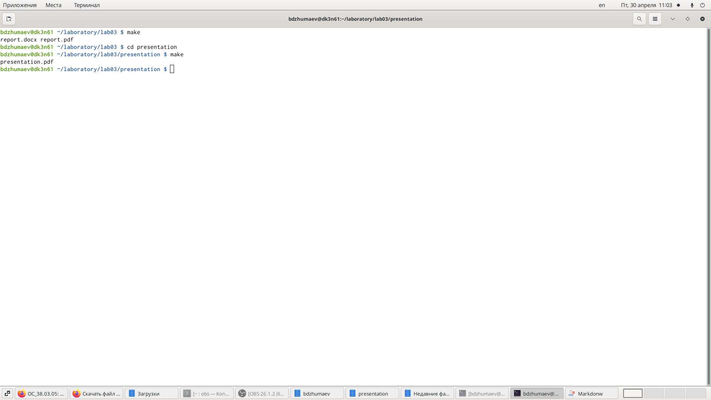

---
## Front matter
lang: ru-RU
title: Markdonw
author: |
	Джумаев Бегенч
date: 29 апреля 2021

## Formatting
toc: false
slide_level: 2
theme: metropolis
header-includes: 
 - \metroset{progressbar=frametitle,sectionpage=progressbar,numbering=fraction}
 - '\makeatletter'
 - '\beamer@ignorenonframefalse'
 - '\makeatother'
aspectratio: 43
section-titles: true
---

# Презентация по лабе №3

## Слайд 1
Оформиление отсчета через markdown
{#fig:001  dth=70%}

## Слайд 2
Оформиление отсчета через markdown
{#fig:001  dth=70%}

## Слайд 3
{#fig:001  dth=70%}

## Слайд 4
{#fig:001  dth=70%}

## Вывод
Я научился оформлять отчёты с помощью легковесного языка разметки Markdown.

