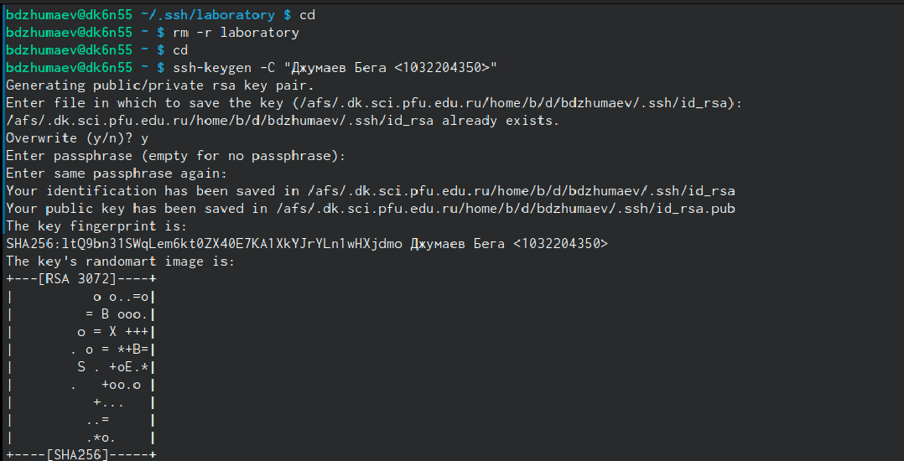
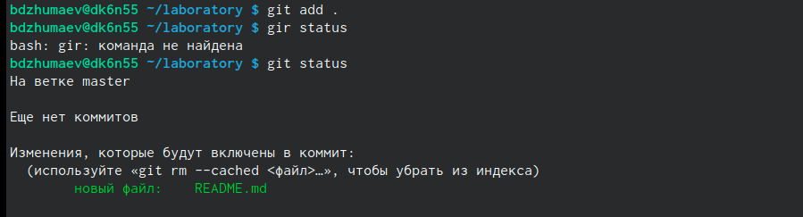
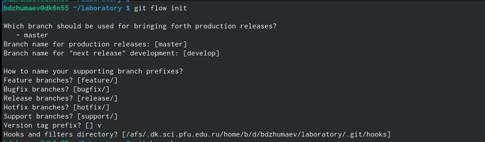
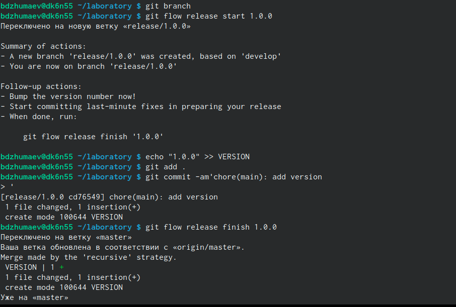
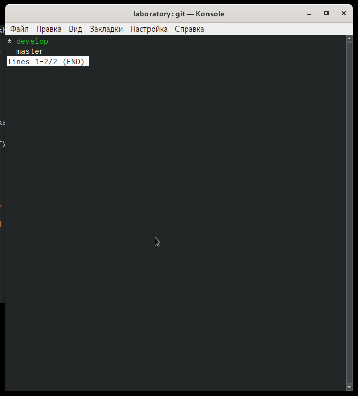

---
# Front matter
lang: ru-RU
title: " отчёта по лабораторной работе №2"
subtitle: "Управление версиями"
author: "Джумаев Бегенч"

# Formatting
toc-title: "Содержание"
toc: true # Table of contents
toc_depth: 2
lof: true # List of figures
lot: true # List of tables
fontsize: 12pt
linestretch: 1.5
papersize: a4paper
documentclass: scrreprt
polyglossia-lang: russian
polyglossia-otherlangs: english
mainfont: PT Serif
romanfont: PT Serif
sansfont: PT Sans
monofont: PT Mono
mainfontoptions: Ligatures=TeX
romanfontoptions: Ligatures=TeX
sansfontoptions: Ligatures=TeX,Scale=MatchLowercase
monofontoptions: Scale=MatchLowercase
indent: true
pdf-engine: lualatex
header-includes:
  - \linepenalty=10 # the penalty added to the badness of each line within a paragraph (no associated penalty node) Increasing the value makes tex try to have fewer lines in the paragraph.
  - \interlinepenalty=0 # value of the penalty (node) added after each line of a paragraph.
  - \hyphenpenalty=50 # the penalty for line breaking at an automatically inserted hyphen
  - \exhyphenpenalty=50 # the penalty for line breaking at an explicit hyphen
  - \binoppenalty=700 # the penalty for breaking a line at a binary operator
  - \relpenalty=500 # the penalty for breaking a line at a relation
  - \clubpenalty=150 # extra penalty for breaking after first line of a paragraph
  - \widowpenalty=150 # extra penalty for breaking before last line of a paragraph
  - \displaywidowpenalty=50 # extra penalty for breaking before last line before a display math
  - \brokenpenalty=100 # extra penalty for page breaking after a hyphenated line
  - \predisplaypenalty=10000 # penalty for breaking before a display
  - \postdisplaypenalty=0 # penalty for breaking after a display
  - \floatingpenalty = 20000 # penalty for splitting an insertion (can only be split footnote in standard LaTeX)
  - \raggedbottom # or \flushbottom
  - \usepackage{float} # keep figures where there are in the text
  - \floatplacement{figure}{H} # keep figures where there are in the text
---

# Цель работы

изучать  идеологию и пременение контроля версий. 

# Задание

1. настройка git
2. подключение  репозитория  к github
3. Первичная конфигурация
4. конфигурация  git-flow

# Выполнение лабораторной работы
## Настройка git

{ #fig:001 width=70% }

 создал аккаунтан github
 
2. Подключение репозитория r github

{ #fig:001 width=70% }

 Создал рабочий laboratory  b репозиторий  OSLAB. Добавил файл README.md и к нему  добавил   commit “first commit” после чего отправил на гитхаб.
 
3. Первичная конфигурации

{ #fig:001 width=70% }

{ #fig:001 width=70% }

 Добавил файл лицензии 
 4. Конфигуриция git-flow
 
{ #fig:001 width=70% }

{ #fig:001 width=70% }

{ #fig:001 width=70% }

Инициализировал  git flow
проверил что нахожусь на ветке develop
создал резил версии 1.0.0 и записал туда релиз
Добавил релизную ветку в основную и отправил данные на гитхаб.

# Выводы

научился применять   средства котроля версий.
