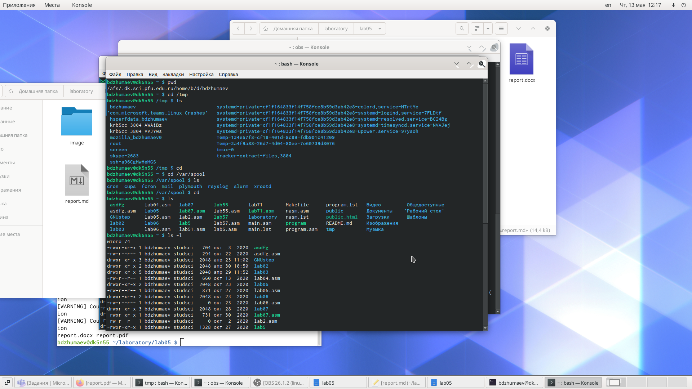
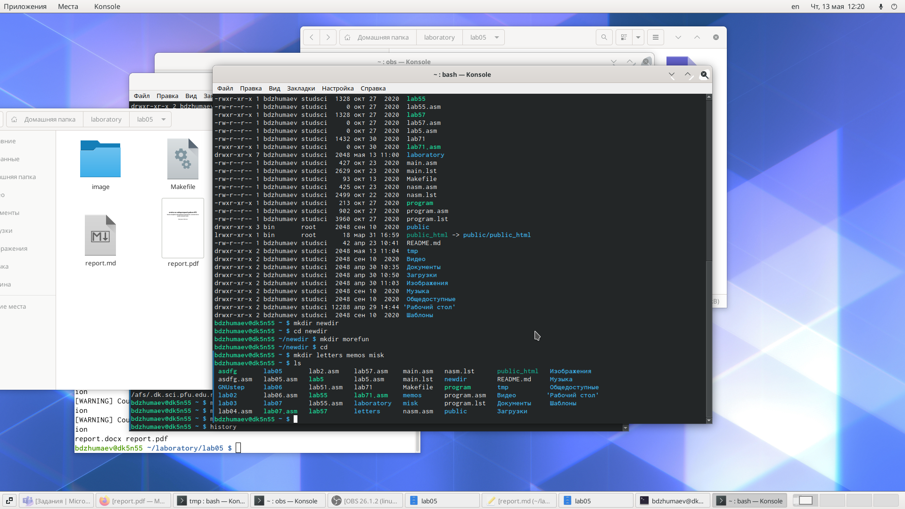
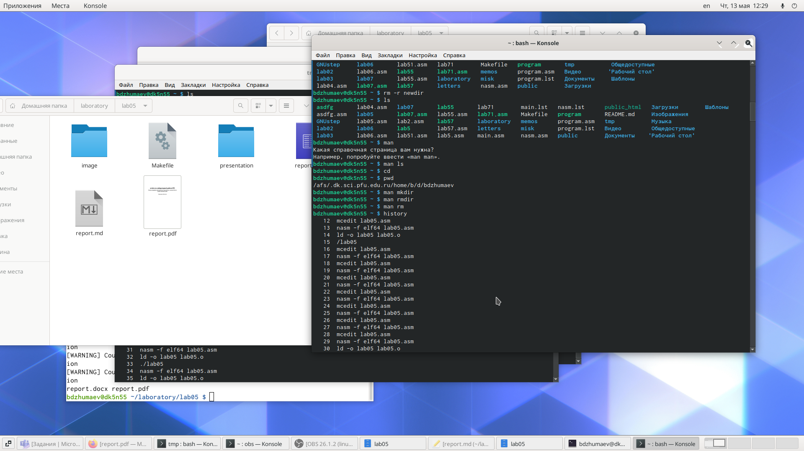
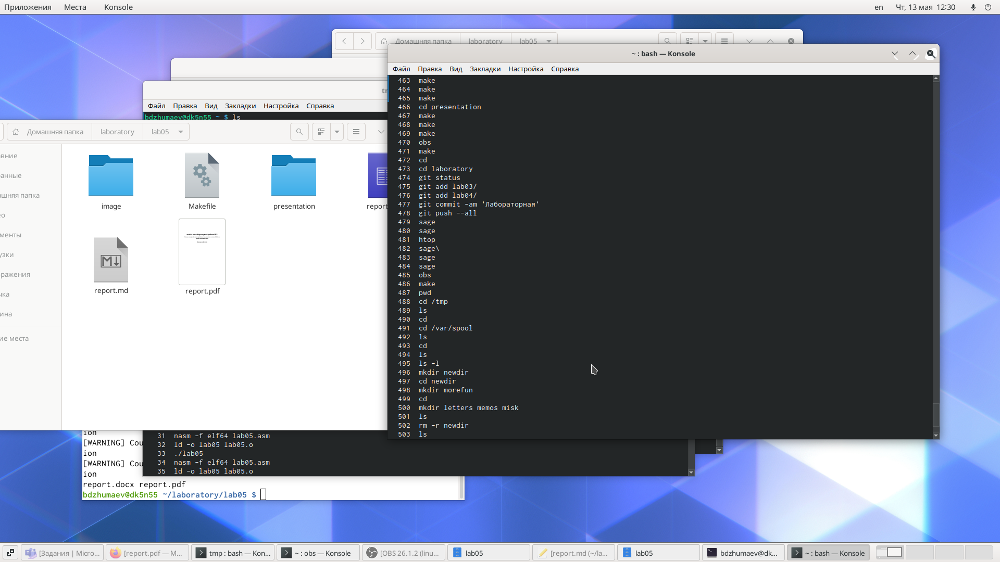
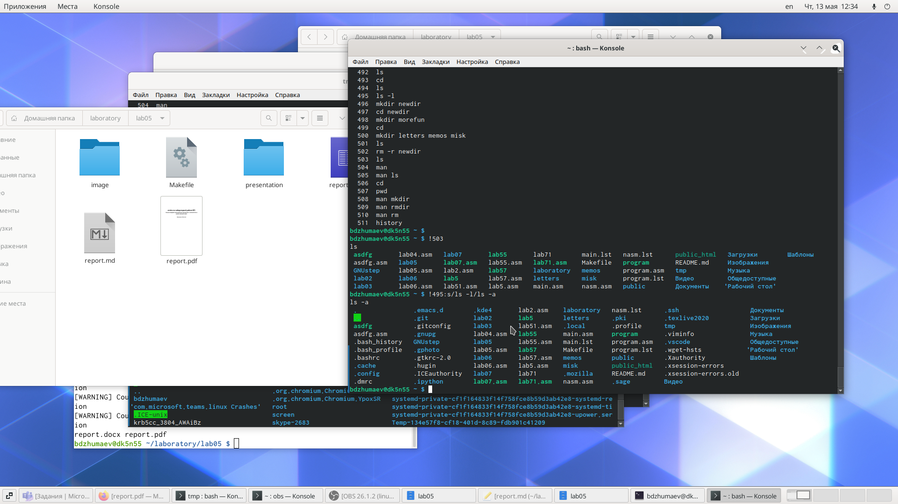

---
## Front matter
lang: ru-RU
title: Приобретение практических навыков взаимодействия пользователя с системойпосредством командной строки.
author: | 
	Джумаев Бегенч
date: 13.05.2021

## Formatting
toc: false
slide_level: 2
theme: metropolis
header-includes: 
 - \metroset{progressbar=frametitle,sectionpage=progressbar,numbering=fraction}
 - '\makeatletter'
 - '\beamer@ignorenonframefalse'
 - '\makeatother'
aspectratio: 43
section-titles: true
---

# Презентация по лабе №5

## Цель работы 

 Приобретение практических навыков взаимодействия пользователя с системой посредством командой строки. 

  Ход работы 
  
## Домашний коталог

{#fig:001  dth=70%}

## Создание нового каталога с именем newdir

{#fig:001  dth=70%}

## Команда man
{#fig:001  dth=70%}

## использование команды man для простмотра описания команд

{#fig:001  dth=70%}

## Команда history 

{#fig:001  dth=70%}

 Выход

 Я приобрел практические навыки взаимодействия пользователя с системой поссредтвом командой строки.
 
