---
## Front matter
lang: ru-RU
title: "Текстовой редактор vi"
author: |
	Джумаев Бегенч
date: 20.05. 2021

## Formatting
toc: false
slide_level: 2
theme: metropolis
header-includes: 
 - \metroset{progressbar=frametitle,sectionpage=progressbar,numbering=fraction}
 - '\makeatletter'
 - '\beamer@ignorenonframefalse'
 - '\makeatother'
aspectratio: 43
section-titles: true
---

# Презентация по лабе №9

 Познакомиться с операционной системой Linux. Получить практические навы-ки работы с редактором vi, установленным по умолчанию практически во всех дис-трибутивах.

## Выпольнение лабораторой работы

1. Я ознакомился с теоретическим материалом. 

2. Я ознакомился с редактором vi.
 
3. Я выполнил упражнения, используя команды vi.

 Задание 1. Создание нового файла с использованием vi
 
## Создание каталог

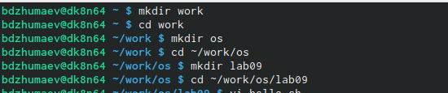{#fig:001  dth=70%}

## Текст

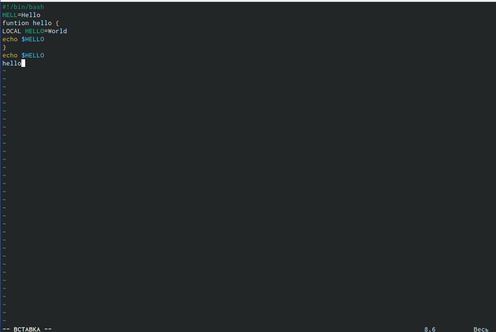{#fig:001  dth=70%}

## Приглашение в виде двоеточия

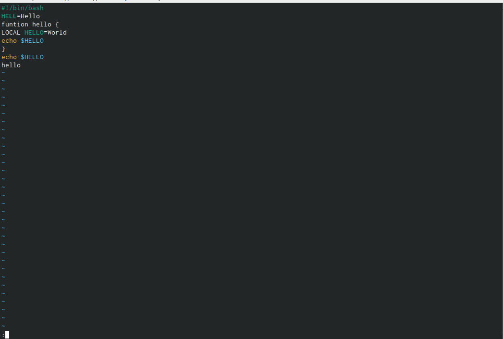{#fig:001  dth=70%}

## Сохранение текста и завершение работы

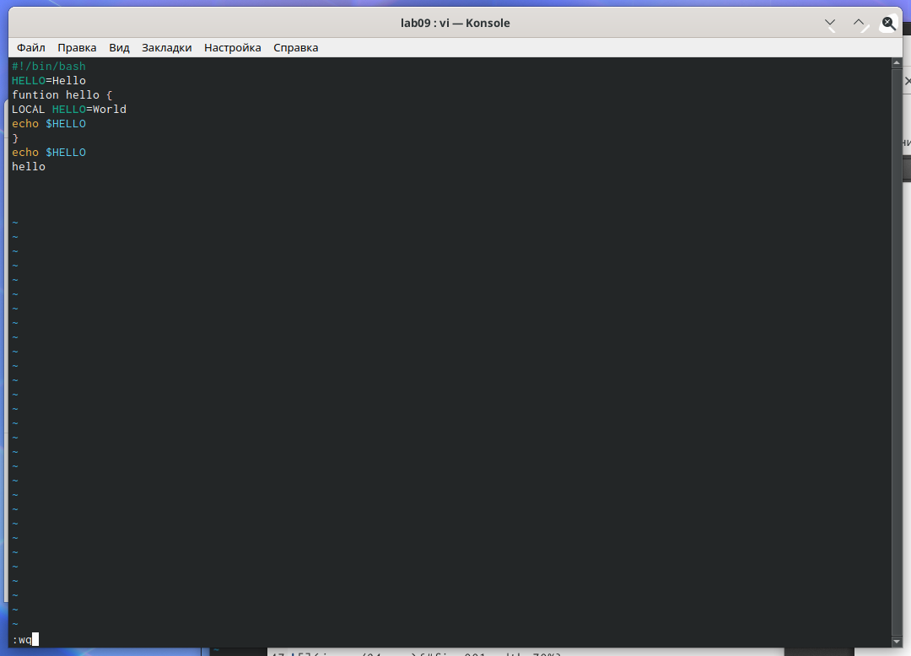{#fig:001  dth=70%}

## Испольняемый файл 

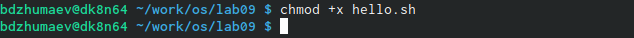{#fig:001  dth=70%}

 Задание 2. Редактирование существущего файла. 
 
## Редактор vi

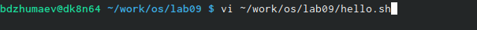{#fig:001  dth=70%}
 
## Установка курсора 

 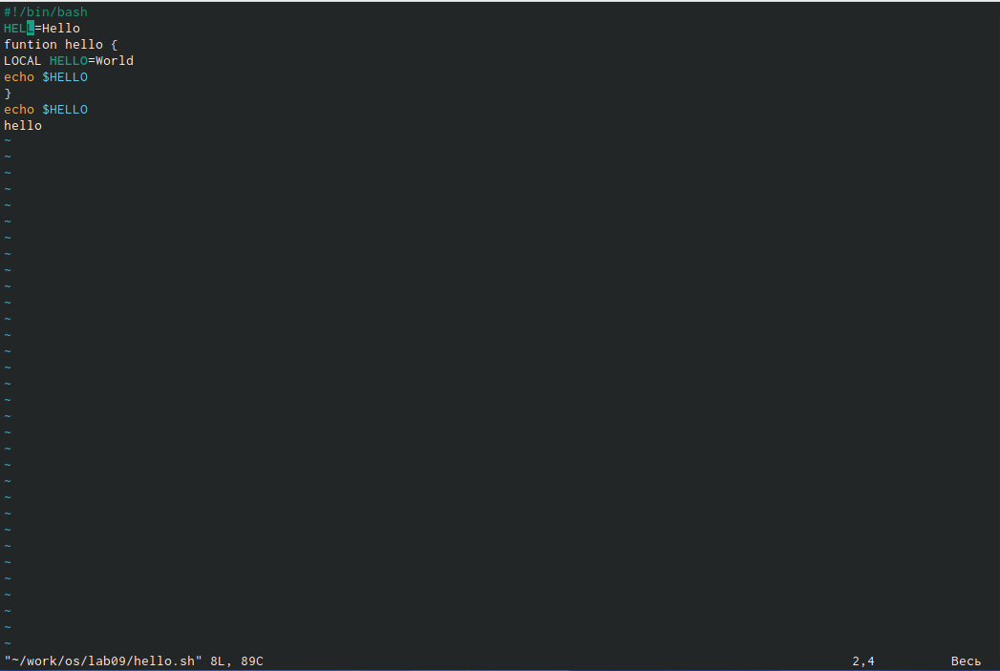{#fig:001  dth=70%}
 
## Режим вставки 

 {#fig:001  dth=70%}
 
## Установка курсора 
 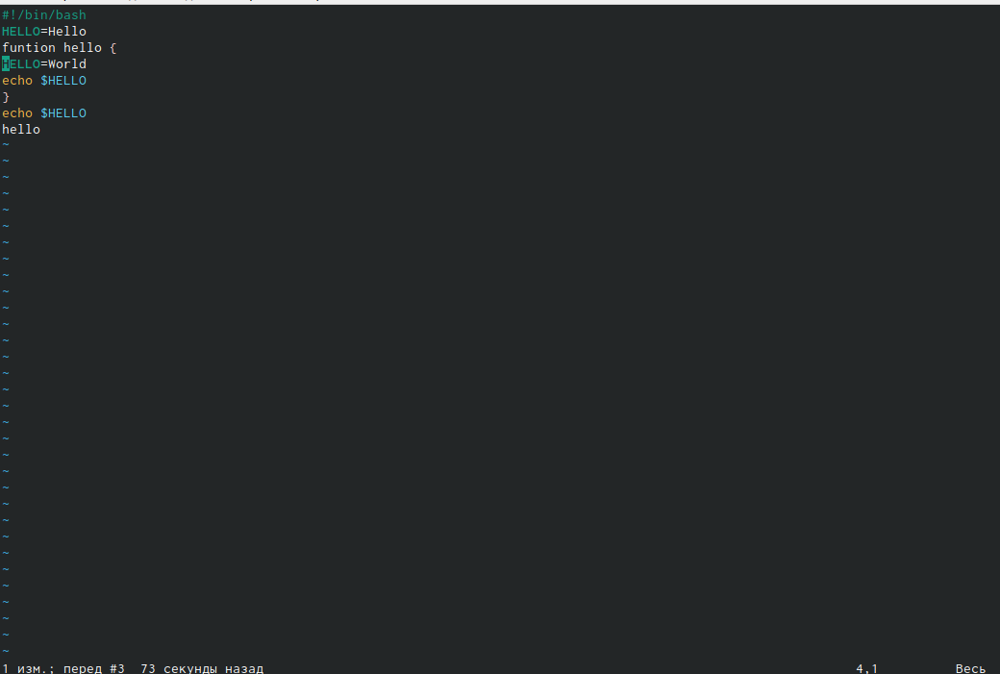{#fig:001  dth=70%}
 
## Удалиение строки
 
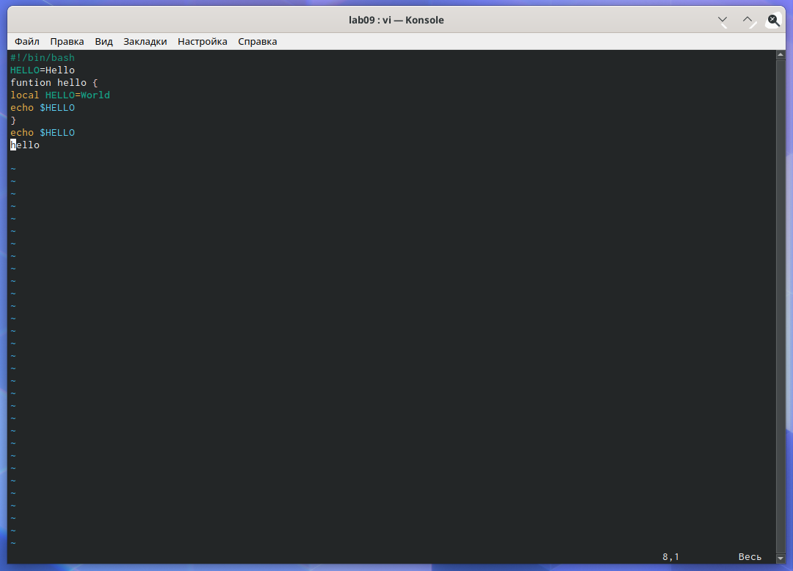{#fig:001  dth=70%}

## Команда u

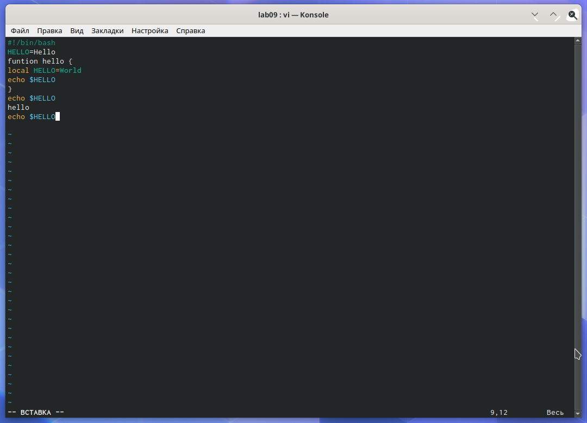{#fig:001  dth=70%}

## символ 
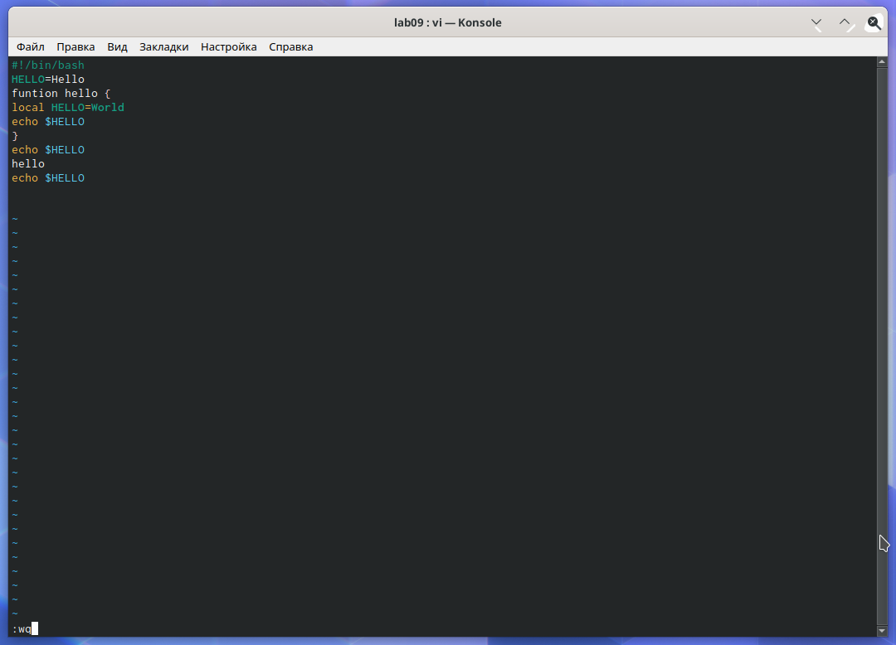{#fig:001  dth=70%}

## Вывод

 Я познакомился с операционной систомой Linux и получил практические навыки работы с редактором vi,установленным по умолчанию практически во всех дистрибутивах.

