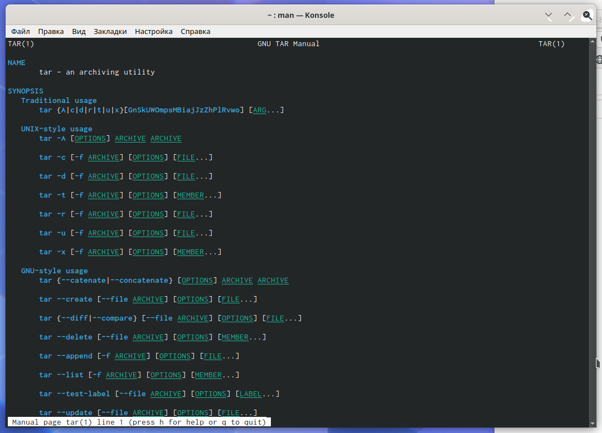
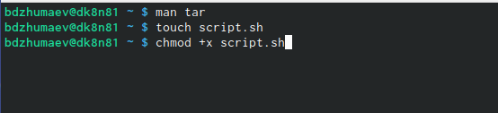
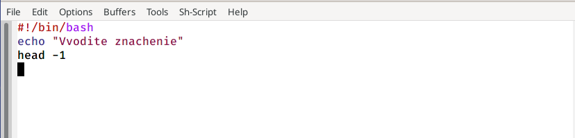
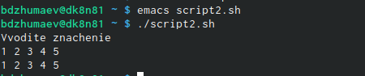
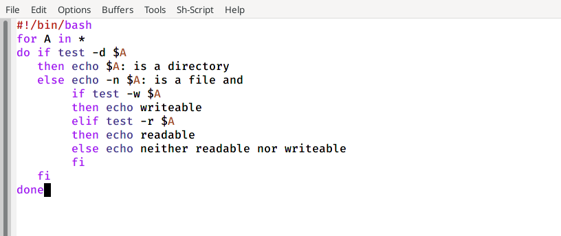

---
## Front matter
lang: ru-RU
title: "Программирование в командномпроцессоре ОС UNIX. Командные файлы"
author:
	Джумаев Бегенч
date: 27.05.2021

## Formatting
toc: false
slide_level: 2
theme: metropolis
header-includes: 
 - \metroset{progressbar=frametitle,sectionpage=progressbar,numbering=fraction}
 - '\makeatletter'
 - '\beamer@ignorenonframefalse'
 - '\makeatother'
aspectratio: 43
section-titles: true
---
   

# Цель работы

 Изучить основы программирования в оболочке ОС UNIX/Linux. Научиться писать небольшие командные файлы.

## Справка команды архивации

{#fig:001  dth=70%}
 
## Создание файла и дача ему права

{#fig:001  dth=70%}

## Скрипт 1

{#fig:001  dth=70%}

## Скрипт в домашней папке

{#fig:001  dth=70%}

## Скрипт 2

{#fig:001  dth=70%}

## Вывод всех переданных аргументов

{#fig:001  dth=70%}

## Командный файл

{#fig:001  dth=70%}

## Информация

{#fig:001  dth=70%}

## Скрипт 3

{#fig:001  dth=70%}

## Вычисление количества файлов

{#fig:001  dth=70%}

## Вывод

 Я изучал основы програмирования в оболочке OC UNIX/Linux и научился писать небольшие команды файлы. 
