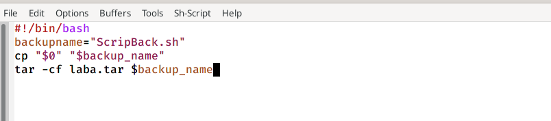
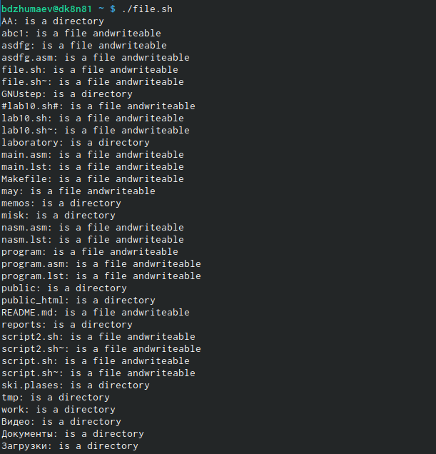
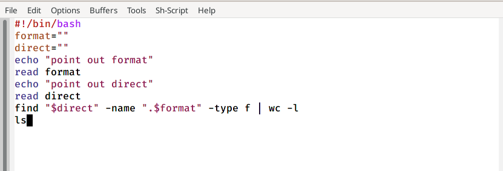
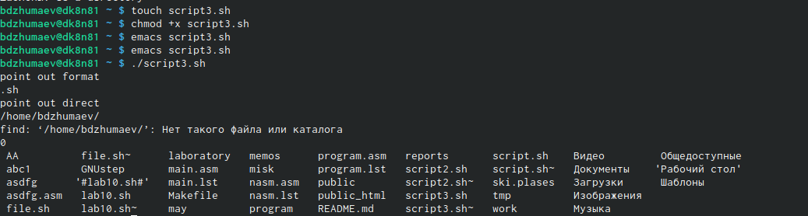

---
# Front matter
lang: ru-RU
title: " отчёта по лабораторной работе №11"
subtitle: "Программирование в командномпроцессоре ОС UNIX. Командные файлы"
author: "Джумаев Бегенч"

# Formatting
toc-title: "Содержание"
toc: true # Table of contents
toc_depth: 2
lof: true # List of figures
lot: true # List of tables
fontsize: 12pt
linestretch: 1.5
papersize: a4paper
documentclass: scrreprt
polyglossia-lang: russian
polyglossia-otherlangs: english
mainfont: PT Serif
romanfont: PT Serif
sansfont: PT Sans
monofont: PT Mono
mainfontoptions: Ligatures=TeX
romanfontoptions: Ligatures=TeX
sansfontoptions: Ligatures=TeX,Scale=MatchLowercase
monofontoptions: Scale=MatchLowercase
indent: true
pdf-engine: lualatex
header-includes:
  - \linepenalty=10 # the penalty added to the badness of each line within a paragraph (no associated penalty node) Increasing the value makes tex try to have fewer lines in the paragraph.
  - \interlinepenalty=0 # value of the penalty (node) added after each line of a paragraph.
  - \hyphenpenalty=50 # the penalty for line breaking at an automatically inserted hyphen
  - \exhyphenpenalty=50 # the penalty for line breaking at an explicit hyphen
  - \binoppenalty=700 # the penalty for breaking a line at a binary operator
  - \relpenalty=500 # the penalty for breaking a line at a relation
  - \clubpenalty=150 # extra penalty for breaking after first line of a paragraph
  - \widowpenalty=150 # extra penalty for breaking before last line of a paragraph
  - \displaywidowpenalty=50 # extra penalty for breaking before last line before a display math
  - \brokenpenalty=100 # extra penalty for page breaking after a hyphenated line
  - \predisplaypenalty=10000 # penalty for breaking before a display
  - \postdisplaypenalty=0 # penalty for breaking after a display
  - \floatingpenalty = 20000 # penalty for splitting an insertion (can only be split footnote in standard LaTeX)
  - \raggedbottom # or \flushbottom
  - \usepackage{float} # keep figures where there are in the text
  - \floatplacement{figure}{H} # keep figures where there are in the text
---

# Цель работы

 Изучить основы программирования в оболочке ОС UNIX/Linux. Научиться пи-сать небольшие командные файлы
 
#  Задание 1

1. Написать скрипт, который при запуске будет делать резервную копию самого се-бя (то есть файла, в котором содержится его исходный код) в другую директориюbackupв вашем домашнем каталоге. При этом файл должен архивироваться одним из архиваторов на выбор zip, bzip2 или tar. Способ использования командархивации необходимо узнать, изучив справку.

2. Написать пример командного файла, обрабатывающего любое произвольноечисло аргументов командной строки, в том числе превышающее десять. Напри-мер, скрипт может последовательно распечатывать значения всех переданныхаргументов.

3. Написать командный файл — аналог команды ls (без использования самой этойкоманды и команды dir). Требуется, чтобы он выдавал информацию о нужномкаталоге и выводил информацию о возможностях доступа к файлам этого каталога.

4. Написать командный файл, который получает в качестве аргумента команднойстроки формат файла (.txt,.doc,.jpg,.pdfи т.д.) и вычисляет количествотаких файлов в указанной директории. Путь к директории также передаётся ввиде аргумента командной строки

# Выполнение лабораторной работы 
 
1.  Я написал скрипт, который при запуске будет делать резервную копию самого себя (то есть файла, в котором содержится его исходный код) в другую директорию backup в моем каталоге. При этом файл должен архивироваться одним из рахиватов на ввыбор zip,bzip2 или tar. Способ использования команд архивации необходимо узнать, изучив справку. 

{ #fig:001 width=70% }

{ #fig:001 width=70% }

{ #fig:001 width=70% }

{ #fig:001 width=70% }

2. Написал пример командного файла, обрабатывающего любое произвольноечисло аргументов командной строки, в том числе превышающее десять. Например, скрипт может последовательно распечатывал значения всех переданныхаргументов.
 
 { #fig:001 width=70% }
 
 { #fig:001 width=70% }
 
 3. Написал командный файл — аналог команды ls (без использования самой этойкоманды и команды dir). Требуется, чтобы он выдавал информацию о нужном каталоге и выводил информацию о возможностях доступа к файлам этого каталога.
 
 { #fig:001 width=70% }
 
 { #fig:001 width=70% }
 
4. Написал командный файл, который получает в качестве аргумента команднойстроки формат файла (.txt,.doc,.jpg,.pdfи т.д.) и вычисляет количествотаких файлов в указанной директории. Путь к директории также передаётся ввиде аргумента командной строки

{ #fig:001 width=70% }

{ #fig:001 width=70% }

# Выводы

 Я изучал основы програмирования в оболочке OC UNIX/Linux и научился писать небольшие командные файлы. 
