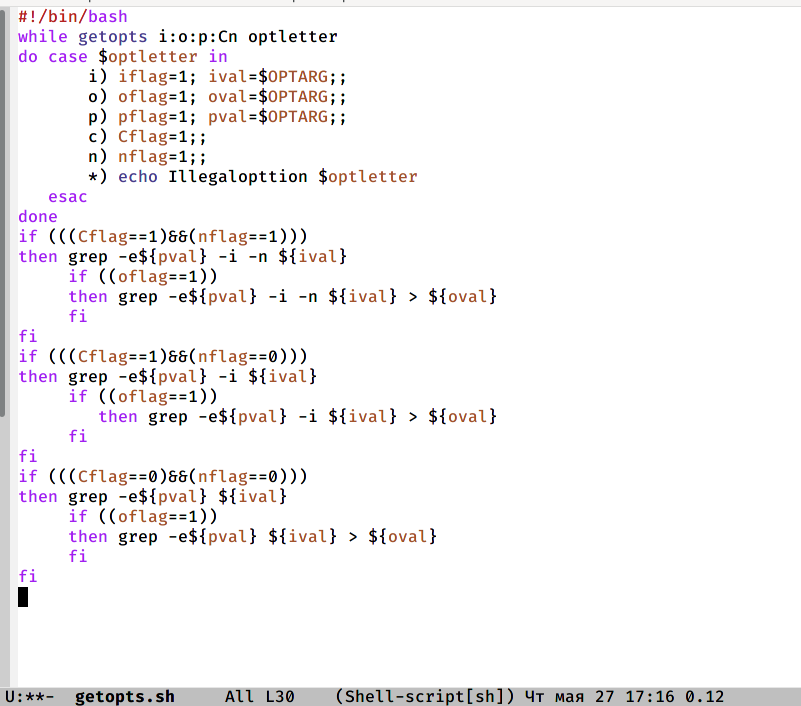
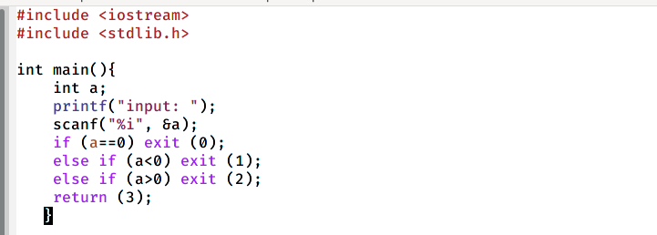
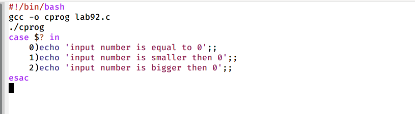
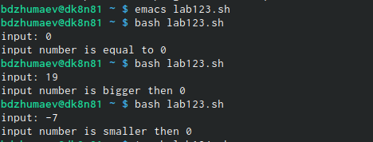
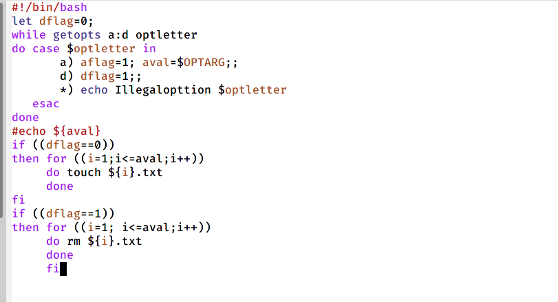
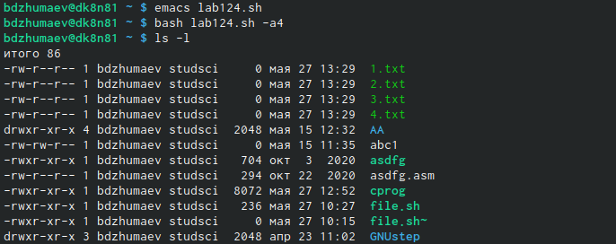
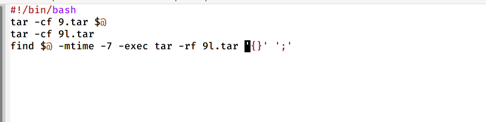
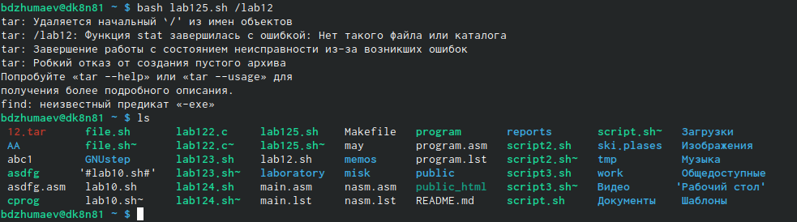

---
## Front matter
lang: ru-RU
title: "Программирование в командномпроцессоре ОС UNIX. Ветвления и циклы"
author: |
	Джумаев Бегенч
date: 28.05.2021

## Formatting
toc: false
slide_level: 2
theme: metropolis
header-includes: 
 - \metroset{progressbar=frametitle,sectionpage=progressbar,numbering=fraction}
 - '\makeatletter'
 - '\beamer@ignorenonframefalse'
 - '\makeatother'
aspectratio: 43
section-titles: true
---

# Цель работы

 Изучить основы программирования в оболочке ОС UNIX. Научится писать бо-лее сложные командные файлы с использованием логических управляющих кон-струкций и циклов.

         

## Ползевания команды getopts grep

{#fig:001  dth=70%}
 
## Язык программа Си

 {#fig:001  dth=70%}

## командный файл

{#fig:001  dth=70%}

## Emacs lab123.sh

 {#fig:001  dth=70%}
 
## Tекст

{#fig:001  dth=70%}

## Lab124.sh

{#fig:001  dth=70%}

## Командный файл, котрый с помощью команды tar

{#fig:001  dth=70%}

## Lab125.sh /lab12

{#fig:001  dth=70%}

## Вывод

 Изучал основы программирования в оболочке ОС UNIX, научилась писать бо-
лее сложные командные файлы с использованием логических управляющих
конструкций и циклов.

