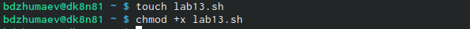
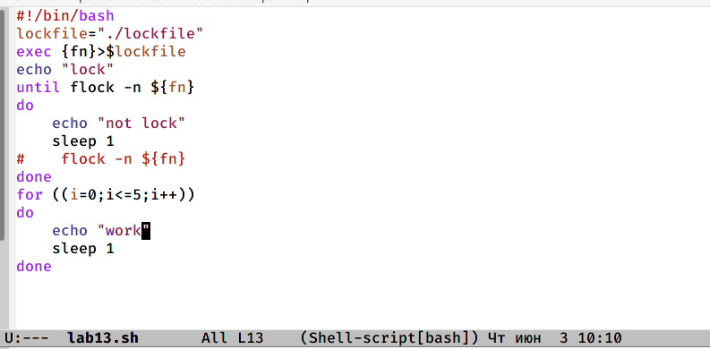
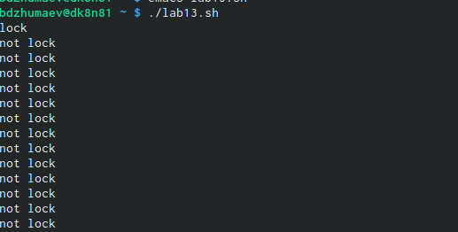
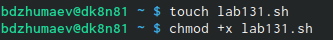
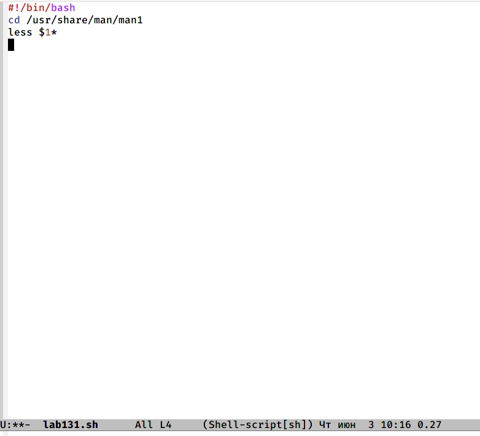
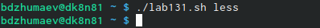
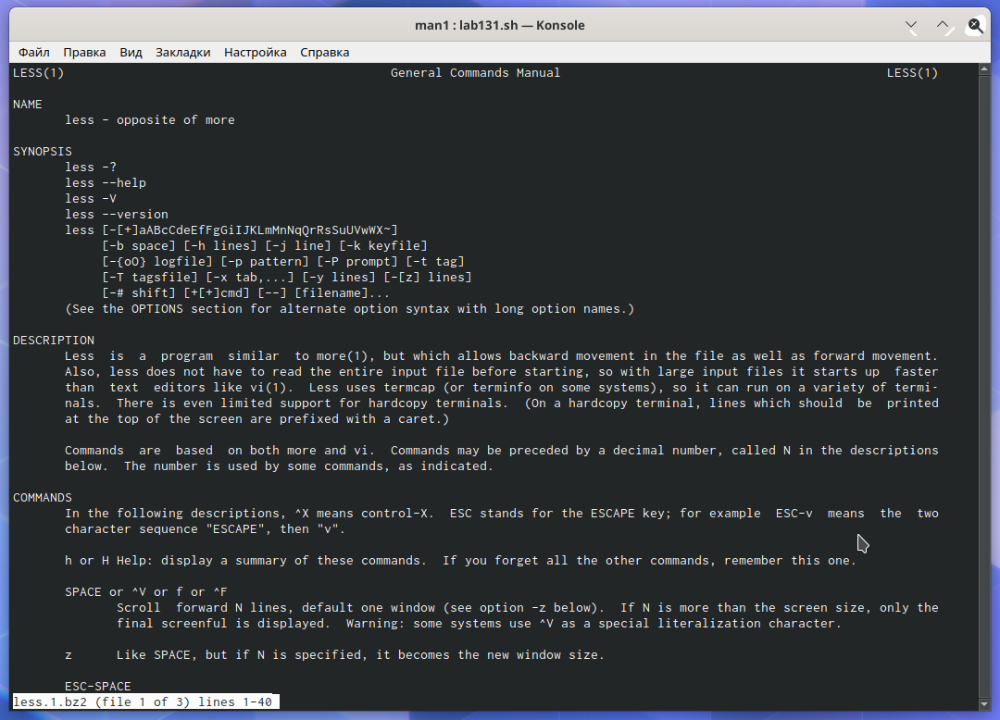
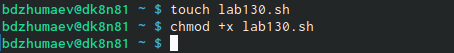
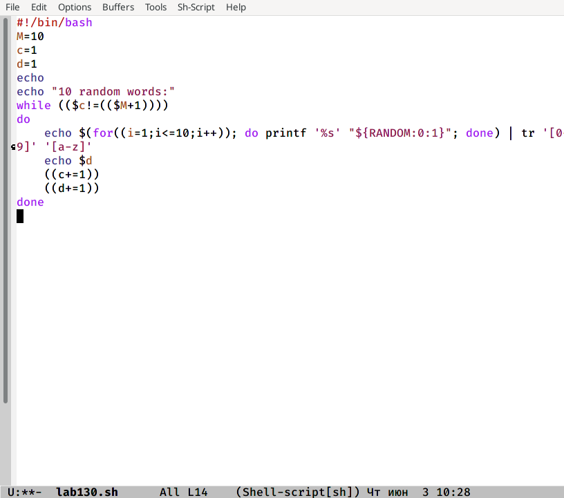
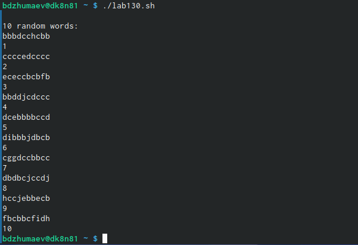

---
## Front matter
lang: ru-RU
title: "Программирование в командномпроцессоре ОС UNIX. Расширенное программирование"
author: |
	Джумаев Бегенч
date: 03.06.2021

## Formatting
toc: false
slide_level: 2
theme: metropolis
header-includes: 
 - \metroset{progressbar=frametitle,sectionpage=progressbar,numbering=fraction}
 - '\makeatletter'
 - '\beamer@ignorenonframefalse'
 - '\makeatother'
aspectratio: 43
section-titles: true
---

# Цель работы

 Изучить основы программирования в оболочке ОС UNIX. Научиться писать бо-лее сложные командные файлы с использованием логических управляющих кон-струкций и циклов.
         

## Создание файла и дача ему прав

{#fig:001  dth=70%}
 
## командный файл

 {#fig:001  dth=70%}

## Упрощенный механизм семафоров

{#fig:001  dth=70%}

## Создание файла и дача ему прав

 {#fig:001  dth=70%}
 
## командный файл

{#fig:001  dth=70%}

## Открытие архива

{#fig:001  dth=70%}

## содержимое справки

{#fig:001  dth=70%}

## Создание файла и дача ему прав

{#fig:001  dth=70%}

## Командный файл

{#fig:001  dth=70%}

## Случайная последовательность букв

{#fig:001  dth=70%}

## Вывод

 Изучал основы программирования в оболочке ОС UNIX, научилась писать более сложные командные файлы с использованием логических управляющих конструкций и циклов.

