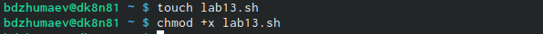
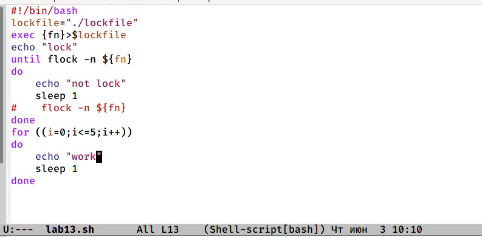
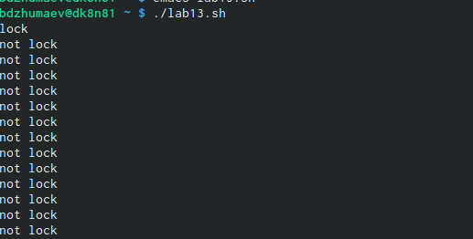
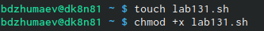
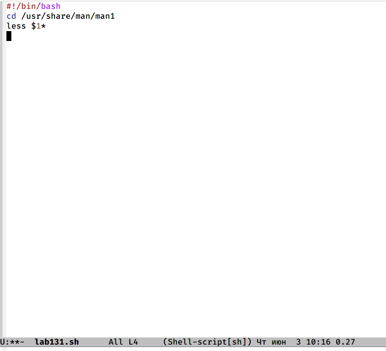
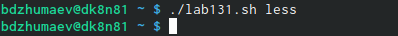
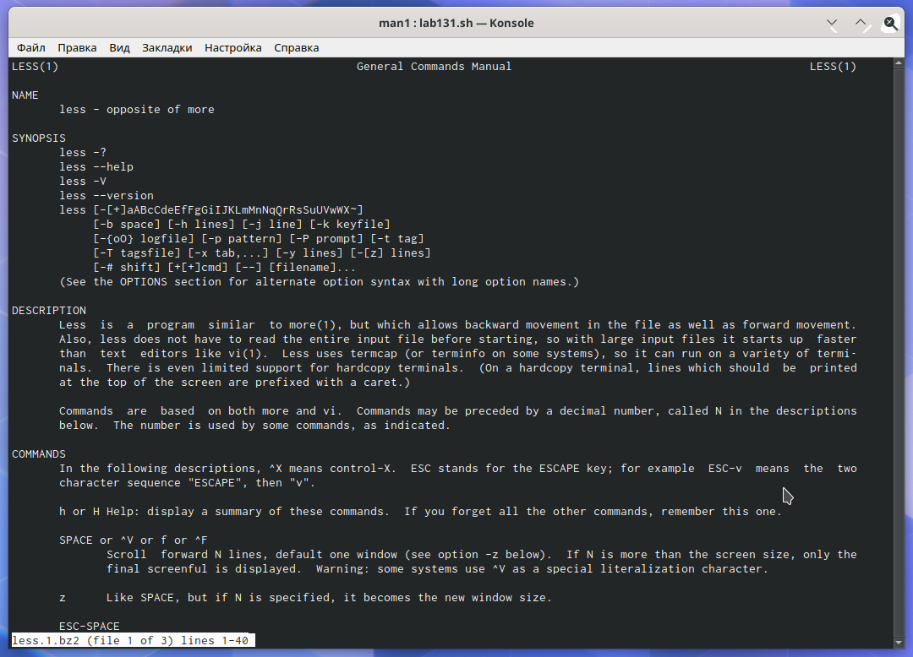
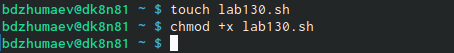
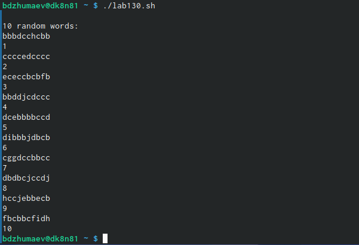

---
# Front matter
lang: ru-RU
title: " Oтчёта по лабораторной работе №13"
subtitle: "Программирование в командномпроцессоре ОС UNIX. Расширенное программирование"
author: "Джумаев Бегенч"

# Formatting
toc-title: "Содержание"
toc: true # Table of contents
toc_depth: 2
lof: true # List of figures
lot: true # List of tables
fontsize: 12pt
linestretch: 1.5
papersize: a4paper
documentclass: scrreprt
polyglossia-lang: russian
polyglossia-otherlangs: english
mainfont: PT Serif
romanfont: PT Serif
sansfont: PT Sans
monofont: PT Mono
mainfontoptions: Ligatures=TeX
romanfontoptions: Ligatures=TeX
sansfontoptions: Ligatures=TeX,Scale=MatchLowercase
monofontoptions: Scale=MatchLowercase
indent: true
pdf-engine: lualatex
header-includes:
  - \linepenalty=10 # the penalty added to the badness of each line within a paragraph (no associated penalty node) Increasing the value makes tex try to have fewer lines in the paragraph.
  - \interlinepenalty=0 # value of the penalty (node) added after each line of a paragraph.
  - \hyphenpenalty=50 # the penalty for line breaking at an automatically inserted hyphen
  - \exhyphenpenalty=50 # the penalty for line breaking at an explicit hyphen
  - \binoppenalty=700 # the penalty for breaking a line at a binary operator
  - \relpenalty=500 # the penalty for breaking a line at a relation
  - \clubpenalty=150 # extra penalty for breaking after first line of a paragraph
  - \widowpenalty=150 # extra penalty for breaking before last line of a paragraph
  - \displaywidowpenalty=50 # extra penalty for breaking before last line before a display math
  - \brokenpenalty=100 # extra penalty for page breaking after a hyphenated line
  - \predisplaypenalty=10000 # penalty for breaking before a display
  - \postdisplaypenalty=0 # penalty for breaking after a display
  - \floatingpenalty = 20000 # penalty for splitting an insertion (can only be split footnote in standard LaTeX)
  - \raggedbottom # or \flushbottom
  - \usepackage{float} # keep figures where there are in the text
  - \floatplacement{figure}{H} # keep figures where there are in the text
---

# Цель работы

 Изучить основы программирования в оболочке ОС UNIX. Научиться писать бо-лее сложные командные файлы с использованием логических управляющих кон-струкций и циклов
 
# Задание

1. Написать командный файл, реализующий упрощённый механизм семафоров. Командный файл должен в течение некоторого времени t1 дожидаться освобождения ресурса, выдавая об этом сообщение, а дождавшись его освобождения, использовать его в течение некоторого времени t2<>t1, также выдавая информацию о том, что ресурс используется соответствующим командным файлом (процессом). Запустить командный файл в одном виртуальном терминале в фоновомрежиме, перенаправив его вывод в другой (> /dev/tty#, где#— номер терминала куда перенаправляется вывод), в котором также запущен этот файл, ноне фоновом, а в привилегированном режиме. Доработать программу так, чтобы имелась возможность взаимодействия трёх и более процессов.
2. Реализовать командуmanс помощью командного файла. Изучите содержимоекаталога/usr/share/man/man1. В нем находятся архивы текстовых файлов,содержащих справку по большинству установленных в системе программ и команд. Каждый архив можно открыть командой less сразу же просмотрев содержимое справки. Командный файл должен получать в виде аргумента команднойстроки название команды и в виде результата выдавать справку об этой коман-де или сообщение об отсутствии справки, если соответствующего файла нет в каталоге man1.
3. Используя встроенную переменную $RANDOM, напишите командный файл, генерирующий случайную последовательность букв латинского алфавита. Учтите,что $RANDOM выдаёт псевдослучайные числа в диапазоне от 0 до 32767.

# Выполнение лабораторной работы 
 
1. Написал командный файл, реализующий упрощённый механизм семафоров. Я запустил командный файл в одном вертуальном терминале в фоновом режиме, перенаправив его вывод в другой (> /dev/tty#, где#— номер терминала куда перенаправляется вывод), в котором также запущен этот файл, но не фоновом, а в привилегированном режиме. Я доработал программу так, чтобы имелась возможность взаимодействия трёх и более процессов.

{ #fig:001 width=70% }

{ #fig:001 width=70% }

{ #fig:001 width=70% }

2. Я реализовал команду manс помощью командного файла.Изучал содержимо екаталога/usr/share/man/man1. Командный файл должен получать в виде аргумента команднойстроки название команды и в виде результата выдавать справку об этой коман-де или сообщение об отсутствии справки, если соответствующего файла нет в каталоге man1.

{ #fig:001 width=70% }

{ #fig:001 width=70% }

{ #fig:001 width=70% }

{ #fig:001 width=70% }

3. Я используя встроенную переменную $RANDOM, написал командный файл, генерирующий случайную последовательность букв латинского алфавита.

{ #fig:001 width=70% }

{ #fig:001 width=70% }

{ #fig:001 width=70% }

# Выводы

 Я изучал основы программирования в оболочке ОС UNIX и научил писать более сложнее командные файлы с использованием логических управляющих и циклов. 

# Контрольные вопросы

1. В строке while [$1 != "exit"] квадратные скобки надо заменить на круглые.

2. Есть несколько видов конкатенации строк. Например,

 VAR1="Hello,"

 VAR2=" World"

 VAR3="$VAR1$VAR2"

 echo "$VAR3"

3. Команда seq выводит последовательность целых или действительных чисел, подходящую для передачи в другие программы. В bash можно использовать seq с циклом for, используя подстановку команд. Например,

 $ for i in $(seq 1 0.5 4)

 do

 echo "The number is $i"

 done

4. Результатом вычисления выражения $((10/3)) будет число 3.

5. Список того, что можно получить, используя Z Shell вместо Bash:

 Встроенная команда zmv поможет массово переименовать файлы/директории, например, чтобы добавить ‘.txt’ к имени каждого файла, запустите zmv –C '(*)(#q.)' '$1.txt'.

 Утилита zcalc — это замечательный калькулятор командной строки, удобный способ считать быстро, не покидая терминал.

 Команда zparseopts — это однострочник, который поможет разобрать сложные варианты, которые предоставляются скрипту.

Команда autopushd позволяет делать popd после того, как с помощью cd, чтобы вернуться в предыдущую директорию.

Поддержка чисел с плавающей точкой (коей Bash не содержит).

Поддержка для структур данных «хэш».
  
