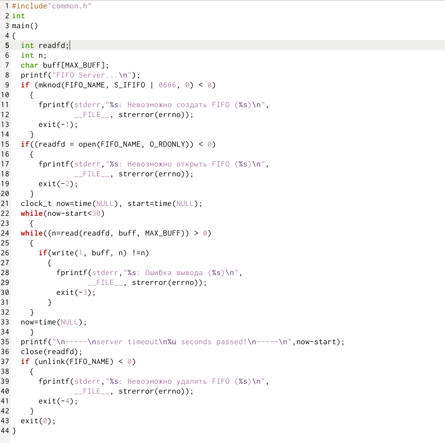

---
## Front matter
lang: ru-RU
title: "Именованные каналы"
author: |
	Джумаев Бегенч
date: 10.06.2021

## Formatting
toc: false
slide_level: 2
theme: metropolis
header-includes: 
 - \metroset{progressbar=frametitle,sectionpage=progressbar,numbering=fraction}
 - '\makeatletter'
 - '\beamer@ignorenonframefalse'
 - '\makeatother'
aspectratio: 43
section-titles: true
---

# Цель работы

 Приобретение практических навыков работы с именованными каналами

        
## common.h

{#fig:001  dth=70%}
 
## Server.c

{#fig:001  dth=70%}

{#fig:001  dth=70%}

## client.c

{#fig:001  dth=70%}

## Common.h

{#fig:001  dth=70%}

## Server.c

 {#fig:001  dth=70%}
 
## client.c

{#fig:001  dth=70%}

## client2.c

{#fig:001  dth=70%}

## ./client.c и client2.c

{#fig:001  dth=70%}

{#fig:001  dth=70%}

## ./server

 {#fig:001  dth=70%}

## Вывод

 Приобрел практические навыки работы с именованными каналами.
